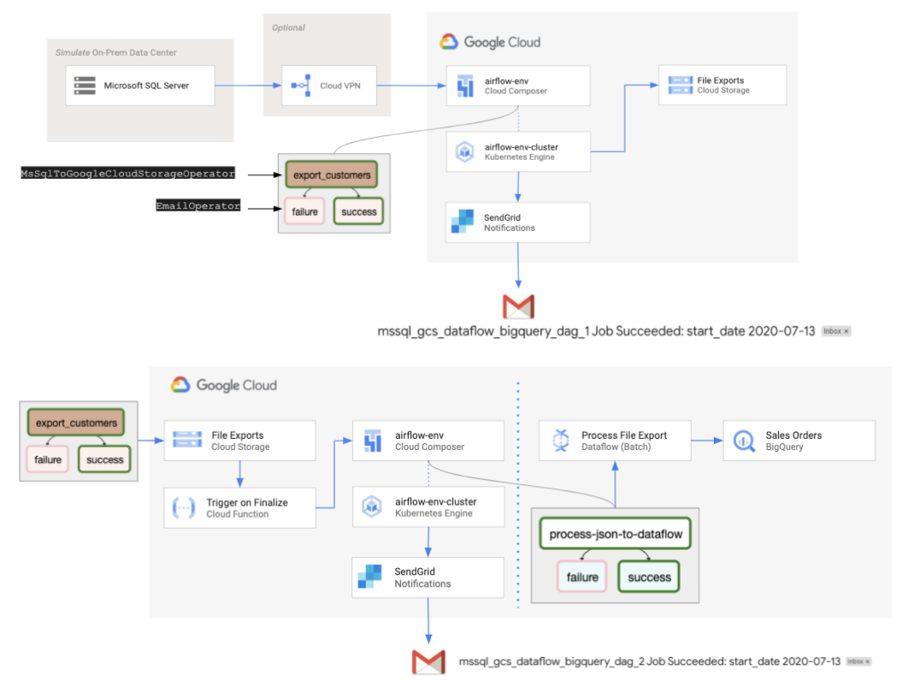

# Cloud Composer Orchestrating Moving Data from Microsoft SQL Server to BigQuery
## Google Cloud Composer Example

This repository contains an example of how to leverage Cloud Composer and Cloud Dataflow to move data from a Microsoft SQL Server to BigQuery. The diagrams below demonstrate the workflow pipeline.





The Pipeline Steps are as follows:

1. A Cloud Composer DAG is either scheduled or manually triggered which connects a Microsoft SQL Server defined and exports the defined data to Google Cloud Storage as a JSON file.

2. A second Cloud Composer DAG is triggered by a Cloud Function once the JSON file has been written to the storage bucket.

3. The second Cloud Composer DAG triggers a Dataflow batch job which can if needed perform transformations then it writes the data to BigQuery.

5. Included in both Cloud Composer DAGs is the ability to send email notifications.

You can:
* Schedule the Cloud Composer DAG to export data as needed with date filters.
* Perform transformation in Dataflow.
* Get a notification on a successful or failed jobs.

Requirements:
* You need a Microsoft SQL Server installed either in Google Cloud or elsewhere.

## How to install

1. [Install the Google Cloud SDK](https://cloud.google.com/sdk/install)

2. Create a export storage bucket for **Microsoft SQL Server Exports**

``` shell
gsutil mb gs://[BUCKET_NAME]/
```

3. Create a Dataflow staging storage bucket

``` shell
gsutil mb gs://[BUCKET_NAME]/
```

4. Through the [Google Cloud Console](https://console.cloud.google.com) create a folder named **tmp** in the newly created bucket for the DataFlow staging files


5. [Create a Cloud Composer Environment](https://cloud.google.com/composer/docs/how-to/managing/creating)
* You need to use an image equal to or greater to: composer-1.10.6-airflow-1.10.6
 
6. Create a BigQuery Dataset
``` shell
bq mk [YOUR_BIG_QUERY_DATABASE_NAME]
```

7. Enable the Cloud Dataflow API
``` shell
gcloud services enable dataflow
```

8. Enable the Cloud Composer API
``` shell
gcloud services enable composer.googleapis.com
```

9. Enable the Cloud Functions API
``` shell
gcloud services enable cloudfunctions.googleapis.com
```

10. Granting blob signing permissions to the Cloud Functions Service Account
```shell
gcloud iam service-accounts add-iam-policy-binding \
[YOUR_PROJECT_ID]@appspot.gserviceaccount.com \
--member=serviceAccount:[YOUR_PROJECT_ID]@appspot.gserviceaccount.com \
--role=roles/iam.serviceAccountTokenCreator
```

11. Edit the index.js file
* In the cloned repo, go to the “cloud-functions” directory and edit the index.js file and change the variables listed below.

* To get your your-iap-client-id execute the following:

``` shell
python get-client-id/get_client_id.py [PROJECT_ID] [GCP_REGION] [COMPOSER_ENVIRONMENT]
```

``` js
  // The project that holds your function
  const PROJECT_ID = 'your-project-id';
  // Run python get-client-id/get_client_id.py [PROJECT_ID] [GCP_REGION] [COMPOSER_ENVIRONMENT] to get your client id
  const CLIENT_ID = 'your-iap-client-id';
  // This should be part of your webserver's URL:
  // {tenant-project-id}.appspot.com
  const WEBSERVER_ID = 'your-tenant-project-id';
  // The name of the DAG you wish to trigger
  const DAG_NAME = 'mssql_gcs_dataflow_bigquery_dag_2';
```

12. Deploy the Cloud Function
* In the cloned repo, go to the “cloud-functions” directory and deploy the following Cloud Function.
``` shell
gcloud functions deploy triggerDag --region=us-central1 --runtime=nodejs8 --trigger-event=google.storage.object.finalize --trigger-resource=[YOUR_UPLOADED_EXPORT_STORAGE_BUCKET_NAME]
```

13. Deploy the Cloud Dataflow Pipeline
* Update the fields object to match your table schema
* In the Cloud Console go to the Composer Environments
* Click on the DAGs Folder Icon
* This will open a new window for the Bucket Details
* Create a Folder called dataflow
* Upload the cloud-dataflow/process_json.py file to the dataflow folder

14. Create the following variables in the Airflow Web Server

| Key | Val |
| --- | ----------- |
| bq_output_table | [DATASET.TABLE] |
| email | [YOUR_EMAIL_ADDRESS] |
| gcp_project | [YOUR_PROJECT_ID] |
| gcp_temp_location | gs://[YOUR_DATAFLOW_STAGE_BUCKET]/tmp |
| mssql_export_bucket | [YOUR_UPLOADED_EXPORT_STORAGE_BUCKET_NAME] |


* For the [DATASET.TABLE] use the dataset name you created in step 6 and choose a name for the table. Cloud Dataflow will create the table for you on it's first run.

15. Create a Airflow connection
* From the Airflow interface to go to Admin > Connections
* Edit the mssql_default connection
* Change the details to match your Microsoft SQL Server

16. In the Cloud Console go to the Composer Environments
* In the PYPI Packages add pymssql, it should look like:


17. Follow these instructions for [Configuring SendGrid email services](https://cloud.google.com/composer/docs/how-to/managing/creating#notification)

18. Deploy the two Cloud Composer DAGs
* Before upload the mssql_gcs_dataflow_bigquery_dag_1.py edit line 51 for your respective SQL Statement
* Upload the two file below to the DAGs folder in Google Cloud Storage


  * cloud-composer/mssql_gcs_dataflow_bigquery_dag_1.py
  * cloud-composer/mssql_gcs_dataflow_bigquery_dag_2.py


**This is not an officially supported Google product**